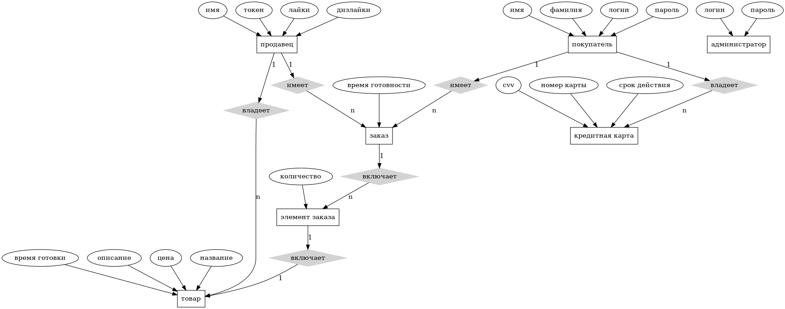

<h1 align="left">
   FeedEm платформа для предзаказа еды.
</h1>

## Роли пользователей

*  Покупатель
*  Продавец
*  Администратор

## Сценарии использования

### BG-1: Уменьшить время ожидания для покупателей

Данное приложение позволит вам совершать предзаказ и получать еду к назначенному времени.

Пользователю предоставляется выбор ресторана, где он может совершить заказ.
В каждом ресторане имеется меню возможных товаров. После составления заказа, пользователю предлагается выбор времени, к которому заказ должен быть приготовлен.  

Сервис feeEm *не* имеет очередей ожидания. 
Всё, что понадобится для заказа - соединение с сетью интернет.

Заказ пользователя готовится к назначенному времени и вместо ожидания в очереди нужно только забрать заказ.

#### F1-1: Покупатель может просматривать каталоги ресторанов

Для просмотра меню ресторана нужно выполнить следующую последовательность действий:                                                                                                     

*  Зайти на сайт.
*  Зарегестрироваться (Если нужно).
*  Пройти авторизацию.
*  Осуществить поиск интересующего ресторана (Поиск осуществляется по описанию, названию, расстоянию до пользователя, по товарам).
*  Выбрать ресторан.

После выполненных действий пользователю будет доступно меню выбранного ресторана.

#### F1-2: Покупатель может осуществить заказ онлайн

Для совершения заказа нужно выполнить следующую последовательность действий:

*  Открыть меню интересующего ресторана.
*  Добавить интересующие пункты меню в корзину.
*  Добавить кредитную карту (Если нужно).
*  Проверить примерное время заказа (Если устраивает, то продолжить).
*  Заказать и оплатить заказ.

#### F1-3: Рейтинговая система для выбора лучшего магазина

Также, пользователи могут поставить оценку ресторану, что поможет другим пользователям выбрать продавца с наилучшим сервисом.
Чтобы это сделать нужно:
*  Открыть страницу ресторана.
*  Поставить оценку (Нравится или не нравится).

### BG-2: Увеличение дохода ресторана

FeedEm создан не для доставки, а для предзаказов.
Цель продавцов - подготовка еды к нужному для клинтов времени. 
Покупатели сам придут, чтобы получить заказ.

#### F2-1: Составление меню для продажи онлайн

Для сосавления меню нужно выполнить следующие действия:

*  Открыть страницу упраления рестораном.
*  Открыть вкладку редактирования меню.
*  Добавить/отредактировать/удалить товары.

#### F2-2: Прием заказов онлайн

Для приема доступных заказов:

*  Открыть страницу упраления рестораном.
*  Открыть вкладку заказов.
*  Принять/отредактировать примерное время/отклонить заказы.

#### F2-3: Просмотр рейтинга ресторанов

Просмотр наиболее популярных ресторанов может помочь узнать, что сейчас интересно покупателям.

Для просмотра рейтинга всех ресторанов:

*  Открыть панель выбора ресторана.На данной странице возможны следующие действия:

    *  Сортировка по выбранному параметру.
    *  Поиск по названию.
    
    
## Компоненты

### Модели (М в модели MVC)
Смотрите ER-диаграмму.

Реализованы как модели в Ruby on rails.

Данные хранятся в Postgresql.

*  Покупатели  - модель, описывающая покупателей.
*  Кредитные карточки - кредитные карточки, которые имеют покупатели. Используются для покупки.
*  Продавцы - модель, описывающая рестораны.
*  Товары - модель, описывающая товары доступные на продажу.
*  Заказы - модель, описывающая заказы, которые запросил покупатель.
*  Элементы заказов - модель, описываюая товары, относящиеся к совершенным заказам пользователей.

### Логика Базы Данных

Покупатели имеют:

*  Логин (Используется для входа)
*  Имя 
*  Фамилию
*  Пароль (Используется дял входа)

Кредитные карточки имеют:

*  Cvv-код (Код безопасности для покупок).
*  Номер карточки (Номер кредитной карточки).
*  Дату истечения срока действия (Срок, когда закончится срок действия)..
*  Id Покупателя, к которуму принадлежит данная карта.

Покупаетли, в свою очередь, могу добавлять новые карточки, через которые они могут совершать покупки.

Заказ имеет:

*  Время (Примерное время приготовления заказа (Вычисляется через сумму примерного время готовки всех товаров  в заказе)).
*  Id Покупателя, который его составил.

Элемент заказа имеет:

*  Id Заказа, к которому принадлежит.
*  Id Товара, который заказал пользователь.
*  Количество Товара (Количество порций данного блюда (Тип - id товара)).

Продавец имеет:

*  Название ресторана (Название магазина, где пользователь может совершать покупки).
*  Токен для аутентификации (Выдается администраторами при успешном запросе регистрации).
*  Дизлайки, выставленные пользователями (Выставляются пользователями, если было составлено отрицательное впечатление о продавце).
*  Лайки, выставленные пользователями (Выставляются пользователями, если было составлено положительное впечатление о продавце).

Товар имеет:

*  Название.
*  Примерное время готовки (Оценка времени выставляется продавцом).
*  Описание (Описание блюда для клиента).
*  Id Продавца, который продаёт данный товар.

Продавец добавляет товары, для своего магазина.

Покупатель совершает заказы товаров выбранного Продавца и оплачивает их Картой. 

У покупателя, в списке заказов, отображается примерное время готовки заказа.

Администратор имеет:

 * Логин.
 * Пароль.

Только Администраторы могут добавлять и удалять продавцов.

Также, Администраторы, для соблюдения порядка, могут удалять некоторые товары, если в описании присутствует
нецензурная лексика.

При утере токена для входа, администратор имеет право сгенерировать новый и выдать продавцу.

Логическая схема:

Полноворматное изображение логической схемы можно увидеть по ссылке:
 
https://raw.githubusercontent.com/s3rius/feedEm/docs/docs/ER.png

### Отображения (V в модели MVC)
Реализованы как отображения в Ruby on rails.

Используется Vue js фраемворк на стороне клиента.

*  Домашняя страница
*  Страница поиска
*  Страница товара
*  Страница заказа товара
*  Страница профиля пользователя
*  Страница входа для пользователя
*  Страница регистрации пользователя
*  Страница профиля продавца
*  Страница входа для продавца
*  Панель администратора

### Контроллеры (C в модели MVC)
Реализованы как контроллеры в Ruby on Rails.

*  Контроллер домашней страницы
*  Контроллер пользователя
*  Контроллер продавца
*  Контроллер заказа
*  Контроллер товара
*  Контроллер кредитных карт
